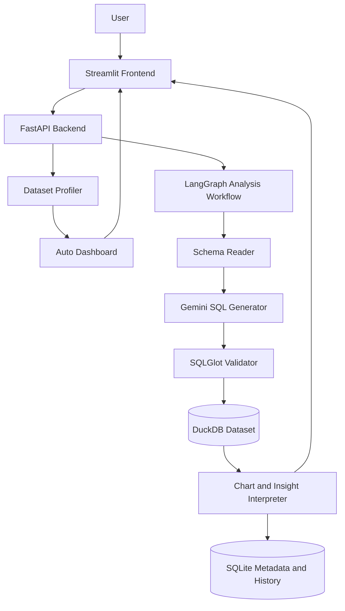

# AI SQL Analyst Agent

A production-style natural-language analytics application. Users upload CSV,
Excel, or SQLite data, ask a business question, and receive generated SQL,
a validated result table, a chart recommendation, and a business explanation.

The analytics paths are dynamic:

`Question -> Schema -> Gemini SQL -> Validation -> DuckDB -> Chart + Insight`

`Upload -> Schema Profile -> Auto Dashboard -> Suggested Questions`

There is no fixed keyword-to-Pandas routing.

## Features

- CSV, XLSX, SQLite, SQLite3, and DB uploads
- One isolated DuckDB database per uploaded dataset
- Multi-sheet Excel and multi-table SQLite ingestion
- Schema extraction with column types, row counts, and sample rows
- Gemini structured-output SQL generation
- SQLGlot AST validation
- Read-only DuckDB execution
- SELECT/WITH-only policy and single-statement enforcement
- Uploaded-table whitelist
- External file and table-function blocking
- Server-enforced result cap
- LangGraph workflow with one configurable SQL correction retry
- Gemini business insights and chart recommendations
- Automatic dataset profiling and semantic role detection
- Auto-generated dashboard with KPI cards, Plotly charts, and cohort retention
- Schema-aware suggested questions after upload
- Plotly chart controls in Streamlit
- Persistent dataset and query history in SQLite
- FastAPI OpenAPI documentation
- Docker and Docker Compose
- Automated backend tests

## Architecture



Each uploaded dataset gets its own DuckDB file. The metadata database stores
dataset records and completed analysis history, not the uploaded business data.

## Safety Model

The generated SQL is treated as untrusted input.

1. SQLGlot parses the query using the DuckDB dialect.
2. Exactly one statement must be present.
3. The statement must be a SELECT query or a WITH query containing SELECT.
4. Every referenced table must exist in the uploaded dataset.
5. Table-valued functions and external readers are rejected.
6. Execution uses a DuckDB read-only connection.
7. The backend wraps results with a server-controlled row limit.

Write operations such as `DROP`, `DELETE`, `UPDATE`, `INSERT`, `ALTER`,
`TRUNCATE`, and `CREATE` cannot pass validation.

## Local Setup

Requirements:

- Python 3.10+
- A Gemini API key

Create and activate a virtual environment:

```powershell
python -m venv .venv
.\.venv\Scripts\Activate.ps1
pip install -r requirements-dev.txt
```

Configure the backend:

```powershell
Copy-Item backend\.env.example backend\.env
```

Set `GEMINI_API_KEY` inside `backend/.env`.

Start FastAPI:

```powershell
cd backend
..\.venv\Scripts\uvicorn.exe app.main:app --reload --env-file .env
```

Start Streamlit in another terminal:

```powershell
$env:API_BASE_URL="http://localhost:8000"
.\.venv\Scripts\streamlit.exe run frontend\app.py
```

Open:

- Streamlit: http://localhost:8501
- FastAPI docs: http://localhost:8000/docs

For Streamlit Community Cloud, add this root-level secret in **App settings >
Secrets**:

```toml
API_BASE_URL = "https://your-railway-service.up.railway.app"
```

Use the Railway service's public domain, without `/docs` or another path.
The frontend verifies the backend identity before displaying stored datasets.

Upload [sample_data/sales.csv](sample_data/sales.csv) to try the application.

For the Adventure Works portfolio demo, upload the included sample:

```text
sample_data/adventure_works_customer_sample.csv
```

The sample keeps complete purchase histories for selected customers, so
customer acquisition and retention cohort pages remain meaningful while the
file stays small enough for fast local testing.

## Docker

Create a root `.env`:

```powershell
Copy-Item .env.example .env
```

Set the Gemini key, then run:

```powershell
docker compose up --build
```

The named `analyst_data` volume persists DuckDB datasets and SQLite history.

See [DEPLOYMENT.md](DEPLOYMENT.md) for Railway, Render, and Streamlit Cloud
deployment steps.

## API

| Method | Endpoint | Purpose |
|---|---|---|
| `GET` | `/health` | Health check |
| `GET` | `/api/v1/datasets` | List uploaded datasets |
| `POST` | `/api/v1/datasets/upload` | Upload CSV, XLSX, or SQLite |
| `GET` | `/api/v1/datasets/{id}/schema` | Inspect tables and columns |
| `GET` | `/api/v1/datasets/{id}/dashboard` | Build profile-driven dashboard |
| `POST` | `/api/v1/datasets/{id}/query` | Execute validated read-only SQL |
| `POST` | `/api/v1/datasets/{id}/analyze` | Run the NL-to-SQL agent |
| `GET` | `/api/v1/datasets/{id}/history` | Retrieve saved analyses |

## Tests

```powershell
cd backend
..\.venv\Scripts\python.exe -m pytest -q
```

Coverage includes uploads, multi-table ingestion, validation, unsafe SQL,
result limits, correction retries, interpretation fallback, auto dashboard
generation, cohort widgets, insights, and persisted history.

## Deployment

Simple portfolio deployment:

- Backend: Railway or Render using `backend/Dockerfile`
- Frontend: Streamlit Community Cloud using `frontend/app.py`
- Persistent storage: attach a volume to the backend service
- Secrets: configure `GEMINI_API_KEY` in the platform secret manager
- Frontend secret: configure `API_BASE_URL` to the deployed backend root URL
- CORS: configure backend `CORS_ORIGINS` to the deployed Streamlit app URL

For a larger production deployment:

- AWS: ECS/Fargate, S3, RDS PostgreSQL, CloudWatch, IAM, Secrets Manager
- Azure: Container Apps, Blob Storage, PostgreSQL, Key Vault, App Insights
- GCP: Cloud Run, Cloud Storage, Cloud SQL, Secret Manager

Object storage and PostgreSQL metadata are natural upgrades when running
multiple backend replicas.

## Project Structure

```text
backend/
  app/
    api/          FastAPI routes
    core/         Configuration
    db/           DuckDB and SQLite repositories
    schemas/      Pydantic contracts
    services/     Ingestion, validation, agent workflow
  tests/
frontend/
  app.py          Streamlit application
  api_client.py   FastAPI client
  charts.py       Plotly chart builder
sample_data/
docker-compose.yml
```

## Current Scope

This version is local-first but portfolio-ready: it demonstrates upload,
profiling, auto dashboards, safe SQL execution, natural-language SQL analysis,
charting, insights, and query history. It does not yet include authentication,
tenant isolation, object storage, distributed workers, or production-grade
observability. Those are documented deployment extensions rather than hidden
inside the portfolio demo.

## Reference Demo Roadmap

The Adventure Works guide maps to these application areas:

- Executive dashboard: KPI cards, monthly sales trend, product, region, and
  segment breakdowns
- Acquisition: first-purchase month and new customer trend
- Retention: cohort heatmap from first purchase month through later activity
- Customer analytics: high-value customers, RFM-style segmentation, and repeat
  customer analysis
- Marketing: campaign flag comparison against sales and retention outcomes
- Forecasting: future upgrade using a time-series model over generated SQL
  outputs
- Production upgrades: object storage for uploads, PostgreSQL metadata,
  cloud logging, secrets management, and role-based access
