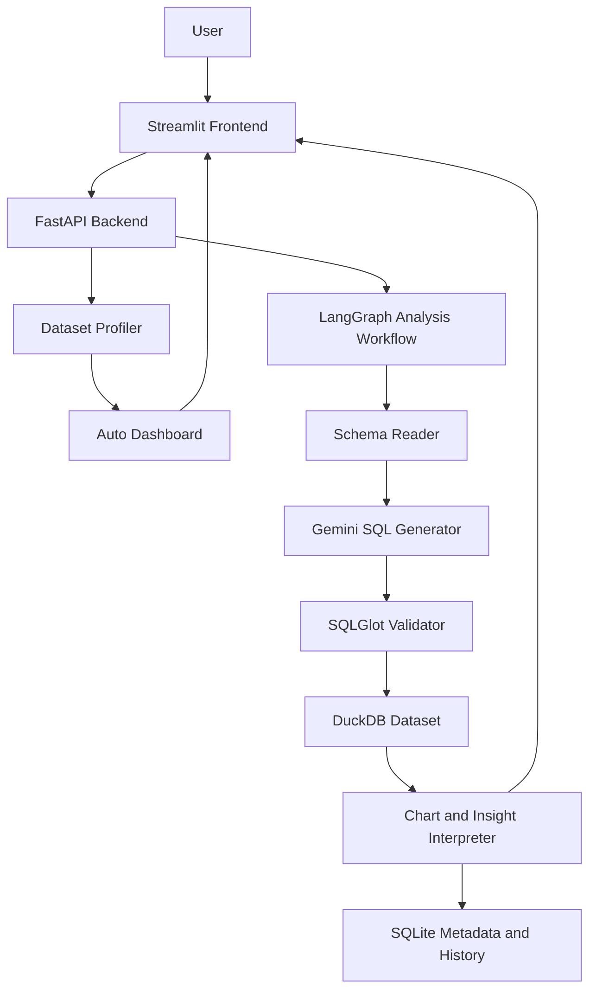

# AI SQL Analyst Agent

A production-style AI analytics application that turns uploaded business data
into safe SQL, dashboards, charts, and business-language insights.

Users can upload CSV, Excel, or SQLite data, ask natural-language questions,
inspect the generated SQL, view result tables, and get chart recommendations
and explanations. The app also profiles each dataset and builds an automatic
dashboard with suggested questions.

## Live Demo

- Streamlit app:
  [https://ai-sql-analyst-agent-b2nfknlnsmcjcpvieoxfgb.streamlit.app/](https://ai-sql-analyst-agent-b2nfknlnsmcjcpvieoxfgb.streamlit.app/)
- Backend health:
  [https://backend-production-f3c5.up.railway.app/health](https://backend-production-f3c5.up.railway.app/health)

Try the app with:

- [sample_data/sales.csv](sample_data/sales.csv)
- [sample_data/adventure_works_customer_sample.csv](sample_data/adventure_works_customer_sample.csv)

## Why This Project Matters

This is not a fixed keyword analytics demo. The core workflow is dynamic:

`Question -> Schema -> Gemini SQL -> Validation -> DuckDB -> Chart -> Insight`

The dashboard workflow is also dynamic:

`Upload -> Schema Profile -> Semantic Roles -> Auto Dashboard -> Suggested Questions`

The system does not route questions through hard-coded Pandas logic such as
`if product then groupby product`. The LLM sees the uploaded schema and sample
rows, generates SQL, the backend validates the SQL, then DuckDB executes only
approved read-only queries.

## Core Features

- CSV, XLSX, SQLite, SQLite3, and DB uploads
- One isolated DuckDB database per uploaded dataset
- Multi-sheet Excel and multi-table SQLite ingestion
- Schema extraction with table names, columns, types, row counts, and samples
- Gemini structured-output natural-language-to-SQL generation
- LangGraph workflow with SQL correction retry
- SQLGlot AST validation before execution
- SELECT/WITH-only SQL policy
- Uploaded-table whitelist
- External file and table-function blocking
- Read-only DuckDB execution
- Server-enforced result cap
- Generated SQL shown to the user
- Result tables in Streamlit
- Plotly chart recommendations and editable chart controls
- Business-language insight generation
- Fallback insight when LLM result interpretation fails
- Automatic dataset profiling and semantic role detection
- Auto dashboard with KPI cards and charts
- Customer acquisition and cohort retention dashboard sections
- Schema-aware suggested questions
- Query history persisted in SQLite
- Docker and Docker Compose support
- Railway backend deployment
- Streamlit Cloud frontend deployment
- Automated tests

## Production-Style Capabilities

This project demonstrates skills expected from AI/LLM and data application
engineering roles:

- LLM tool use and structured outputs
- Natural-language-to-SQL generation
- Agentic workflow design with LangGraph
- Prompt engineering for SQL generation and business insight writing
- SQL safety validation and sandboxed execution
- FastAPI backend design
- Streamlit frontend development
- DuckDB analytics storage
- SQLite metadata and query history
- Data profiling and dashboard generation
- Plotly visualization
- Docker deployment
- Railway and Streamlit Cloud deployment
- Cloud secret management
- Error handling and fallback behavior
- Test-driven backend validation

## Architecture



Each uploaded dataset gets its own DuckDB file. The metadata database stores
dataset records and completed query history, not raw business data.

## AI Workflow

1. User uploads a dataset.
2. Backend converts the data into DuckDB tables.
3. Backend extracts schema, column types, row counts, and sample rows.
4. User asks a business question.
5. Gemini generates a DuckDB SQL query from the schema.
6. SQLGlot validates the query.
7. Unsafe SQL is rejected before execution.
8. DuckDB executes the validated query in read-only mode.
9. The result table is returned to Streamlit.
10. Gemini recommends a chart and writes business-language insights.
11. Query, SQL, result metadata, chart, and insight are saved to history.

## Auto Dashboard Workflow

After upload, the app profiles the dataset and detects semantic roles:

- date columns
- numeric measures
- customer identifiers
- order identifiers
- dimensions such as product, region, segment, gender
- boolean campaign fields

Based on those roles, it builds:

- KPI cards
- monthly trend charts
- category breakdowns
- customer acquisition charts
- cohort retention heatmaps
- marketing comparison charts
- suggested business questions

## SQL Safety Model

Generated SQL is treated as untrusted input.

1. SQLGlot parses SQL using the DuckDB dialect.
2. Exactly one statement must be present.
3. Only SELECT and WITH queries are allowed.
4. Every referenced table must exist in the uploaded dataset.
5. Table-valued functions and external readers are blocked.
6. DuckDB is opened in read-only mode for query execution.
7. The backend applies a server-controlled row limit.

Blocked operations include:

```text
DROP, DELETE, UPDATE, INSERT, ALTER, TRUNCATE, CREATE, COPY, ATTACH,
INSTALL, LOAD, PRAGMA, read_csv, read_parquet, external URLs, external files
```

## Example Questions

- Top 10 customers by revenue
- Which products generated the highest revenue?
- Compare revenue by region
- Show monthly revenue trend
- Which customers bought in January but not February?
- Which products have high quantity but low revenue?
- What is the revenue contribution percentage by product?
- Find declining products month over month
- Which region has the highest growth?
- Show average order value by customer segment
- Create a cohort retention analysis by first purchase month

## Tech Stack

| Layer | Tools |
|---|---|
| Frontend | Streamlit, Plotly, Pandas |
| Backend | FastAPI, Pydantic |
| Agent Workflow | LangGraph |
| LLM | Gemini API |
| SQL Engine | DuckDB |
| Metadata | SQLite |
| SQL Validation | SQLGlot |
| Deployment | Docker, Railway, Streamlit Cloud |
| Testing | Pytest, HTTPX |

## API

| Method | Endpoint | Purpose |
|---|---|---|
| `GET` | `/health` | Backend health check |
| `GET` | `/api/v1/datasets` | List uploaded datasets |
| `POST` | `/api/v1/datasets/upload` | Upload CSV, XLSX, or SQLite |
| `GET` | `/api/v1/datasets/{id}/schema` | Inspect table schemas |
| `GET` | `/api/v1/datasets/{id}/dashboard` | Build profile-driven dashboard |
| `POST` | `/api/v1/datasets/{id}/query` | Execute validated read-only SQL |
| `POST` | `/api/v1/datasets/{id}/analyze` | Run natural-language-to-SQL analysis |
| `GET` | `/api/v1/datasets/{id}/history` | Retrieve saved query history |

## Local Setup

Requirements:

- Python 3.10+
- Gemini API key

Create and activate a virtual environment:

```powershell
python -m venv .venv
.\.venv\Scripts\Activate.ps1
pip install -r requirements-dev.txt
```

Configure the backend:

```powershell
Copy-Item backend\.env.example backend\.env
```

Set `GEMINI_API_KEY` inside `backend/.env`.

Start FastAPI:

```powershell
cd backend
..\.venv\Scripts\uvicorn.exe app.main:app --reload --env-file .env
```

Start Streamlit in another terminal:

```powershell
$env:API_BASE_URL="http://localhost:8000"
.\.venv\Scripts\streamlit.exe run app.py
```

Open:

- Streamlit: http://localhost:8501
- FastAPI docs: http://localhost:8000/docs

## Docker

Create a root `.env`:

```powershell
Copy-Item .env.example .env
```

Set the Gemini key, then run:

```powershell
docker compose up --build
```

The named `analyst_data` volume persists DuckDB datasets and SQLite history.

## Deployment

This repository is deployed as:

- Backend: Railway using `backend/Dockerfile`
- Frontend: Streamlit Cloud using root `app.py`
- Storage: Railway persistent volume at `/app/data`
- Secrets: Gemini key stored in Railway variables
- Frontend config: `API_BASE_URL` points to the Railway backend

See [DEPLOYMENT.md](DEPLOYMENT.md) for full deployment instructions.

## Tests

Run backend tests:

```powershell
cd backend
..\.venv\Scripts\python.exe -m pytest -q
```

Run frontend tests:

```powershell
.\.venv\Scripts\python.exe -m pytest frontend\tests -q
```

Current coverage includes:

- file uploads
- Excel and SQLite ingestion
- schema extraction
- safe SQL execution
- unsafe SQL rejection
- result row limits
- LangGraph correction retry
- fallback result interpretation
- dashboard generation
- cohort widgets
- query history persistence
- chart builder behavior

## Project Structure

```text
backend/
  app/
    api/          FastAPI routes
    core/         Configuration
    db/           DuckDB and SQLite repositories
    schemas/      Pydantic contracts
    services/     Ingestion, validation, dashboard, agent workflow
  tests/
frontend/
  app.py          Streamlit application
  api_client.py   FastAPI client
  charts.py       Plotly chart helpers
sample_data/
app.py            Root Streamlit launcher for Streamlit Cloud
docker-compose.yml
railway.json
DEPLOYMENT.md
```

## Current Scope

This version is a portfolio-ready production-style application. It demonstrates
the core LLM analytics workflow, safe SQL execution, dashboard generation,
deployment, and automated testing.

It does not yet include:

- user authentication
- per-user dataset isolation
- object storage
- PostgreSQL metadata
- distributed workers
- rate limiting
- production observability dashboards

Those are documented as natural production upgrades rather than hidden inside
the demo.

## Roadmap For A Full Production Version

High-impact next features:

- authentication and per-user datasets
- delete dataset and clear history controls
- result export as CSV
- generated SQL export
- dashboard summary export
- RFM customer segmentation
- anomaly detection
- time-series forecasting
- better cohort insight generation
- request logging and query timing
- upload and AI-question rate limits
- background workers for large Excel files
- S3, Azure Blob, or GCP Cloud Storage for uploaded files
- PostgreSQL metadata database
- centralized logs and metrics

## Cloud Upgrade Path

For a larger production deployment:

- AWS: ECS/Fargate, S3, RDS PostgreSQL, CloudWatch, IAM, Secrets Manager
- Azure: Container Apps, Blob Storage, PostgreSQL, Key Vault, App Insights
- GCP: Cloud Run, Cloud Storage, Cloud SQL, Secret Manager

Object storage and PostgreSQL metadata are the most important upgrades when
running multiple backend replicas.

## Interview Talking Points

This project is useful to discuss in interviews because it combines:

- LLM application development
- SQL generation and validation
- agent workflow orchestration
- prompt engineering
- data engineering
- dashboard automation
- backend API design
- cloud deployment
- security-minded execution
- testing and production tradeoffs

The most important design decision is that SQL generated by the LLM is never
trusted directly. It must pass a strict validator before DuckDB executes it.
